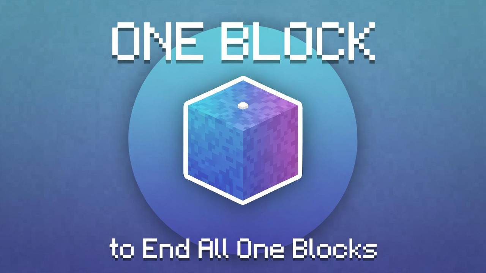

# One Block to End All One Blocks

A Minecraft Fabric mod for **1.21.4** that turns a single block into a full survival challenge — complete with quests, phases, multiplayer support, and team island merging.

## Requirements

- Minecraft 1.21.4
- [Fabric Loader](https://fabricmc.net/use/installer/) 0.16.9+
- [Fabric API](https://modrinth.com/mod/fabric-api) 0.110.5+1.21.4

## Getting Started

### Single Player
1. Create a new **Superflat** world using the **Void** preset.
2. Install the mod and launch. A welcome screen will appear — click **Start Challenge**.
3. A single block appears at your feet. Break it and it regenerates — each break has a chance to drop blocks, items, or spawn mobs based on your current phase.
4. Press **J** to open the Quest Book at any time.

### Multiplayer Server
1. Set the server world type to superflat/void (set `level-type=flat` and configure the void generator preset in `server.properties`).
2. Drop the mod JAR into your `mods/` folder alongside Fabric API.
3. By default players choose to **Start** or **Spectate** on first join. To auto-start everyone, set `"autoStart": true` in `config/oneblocktoendall_server.json`.

## Gameplay

### Phases
There are **6 phases**, each with its own block pool, mob pool, and 4 quests. Completing all 4 quests in a phase automatically advances you to the next, with a celebration screen showing what's newly unlocked.

Every 5th phase transition triggers a **Boss Wave** — a hostile mob spawns near your island to defend against.

### Quests
Each quest tracks one of these goals:
- **Craft** a specific item
- **Mine** a specific block
- **Kill** a specific mob
- **Obtain** a specific item (inventory-based)
- **Custom stat** (e.g., breed animals, enchant items)

Progress is tracked in real-time using Minecraft's built-in stat system. No manual tracking needed.

### Quest Book (J key)
The quest book has a full navigation bar:

| Button | Opens |
|--------|-------|
| Drops | Block & mob pool for each phase |
| Stats | Your personal stats (blocks broken, quests done, time played) |
| Board | Server leaderboard (phase, quests, blocks) |
| Islands | List of all player islands — visit open ones or toggle your own |
| Team | Create or manage your team |
| Settings (⚙) | HUD position, scale, and toast preferences |

## Multiplayer Features

### Island Visiting
Each player's island sits 250 blocks apart along the X axis. Any player can mark their island **Open** from the Islands menu, allowing teammates or visitors to teleport in using `/oneblock visit <player>`.

### Teams
Open the Team menu (Quest Book → Team) to:
- Create a team and give it a name
- Invite other players by username
- Accept or decline incoming invites
- Kick members (leader only)
- Leave a team

### Island Merging ★
When two teammates physically **build a bridge of blocks** connecting their islands, the mod detects the connection automatically (checked every ~10 seconds). On detection:

- Both players receive a **★ Islands Merged! ★** announcement with a celebration screen
- All team members advance to **the highest current phase + 1**
- A server-wide broadcast announces the merge
- Use `/oneblock visit <player>` to teleport between islands freely

This is the intended late-game co-op goal: build toward each other, connect your islands, and unlock the next phase together.

## Commands

| Command | Description |
|---------|-------------|
| `/oneblock start` | Manually start the challenge (if auto-start is off) |
| `/oneblock quests` | Show current quest progress in chat |
| `/oneblock phase` | Show current phase info |
| `/oneblock visit <player>` | Teleport to another player's island (if open) |
| `/oneblock leaderboard` | Show the leaderboard in chat |
| `/oneblock reset` | Reset your progress and start over |
| `/oneblock admin` | Open the admin panel (op level 2 required) |

## Admin Panel
Ops can open `/oneblock admin` to see all players, manually set phases, reset individual players, and toggle the auto-start setting — all from an in-game GUI.

## HUD
A small overlay in the corner shows your current phase and active quest progress. Configurable from the Settings screen:
- **Position** — Top Right / Top Left / Bottom Right / Bottom Left
- **Scale** — 0.5× to 2.0×
- **Toasts** — Enable or disable pop-up notifications for quest/phase completion

## Configuration

| File | Side | Key settings |
|------|------|--------------|
| `config/oneblocktoendall.json` | Client | `hudEnabled`, `hudPosition`, `hudScale`, `toastsEnabled` |
| `config/oneblocktoendall_server.json` | Server | `autoStart` |

## License

MIT
